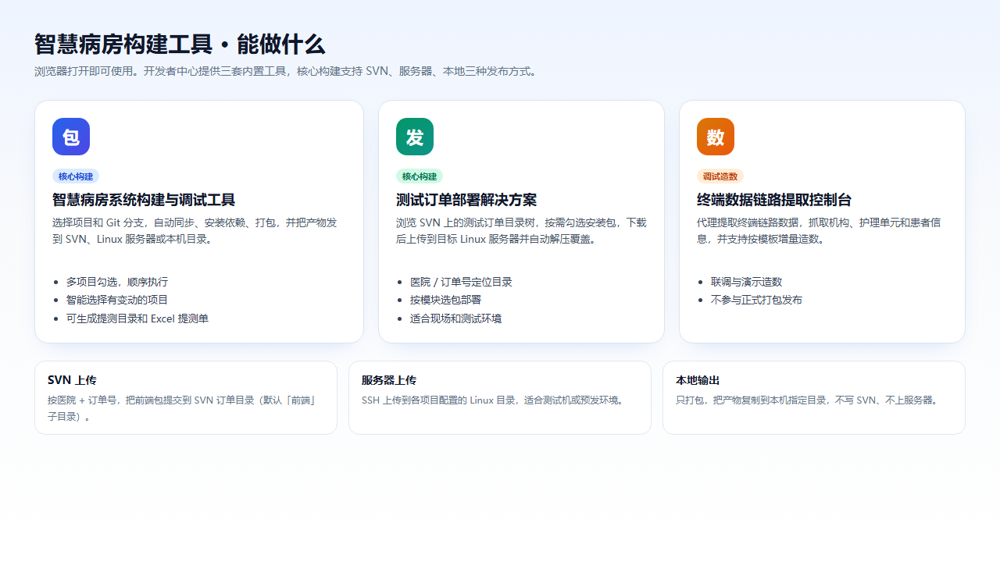
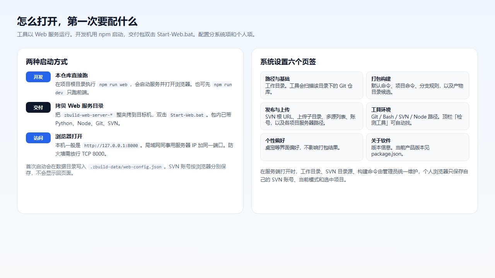
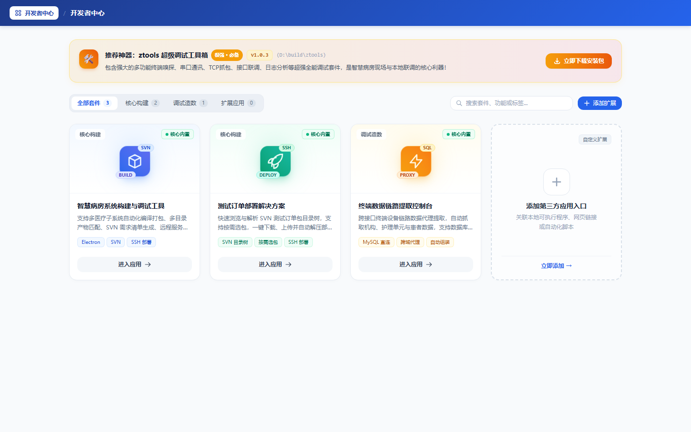
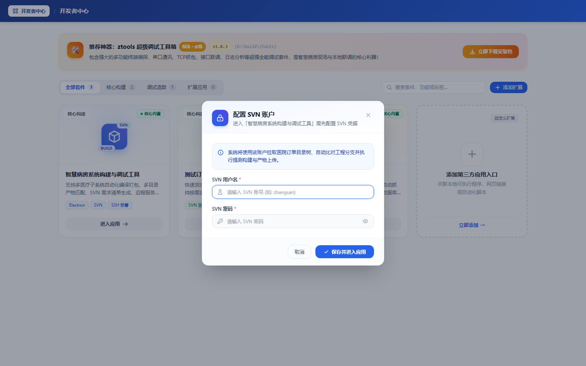
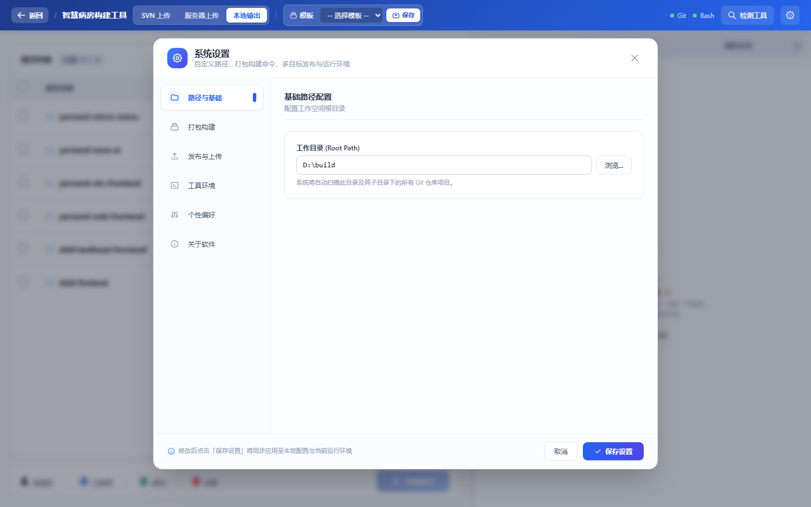
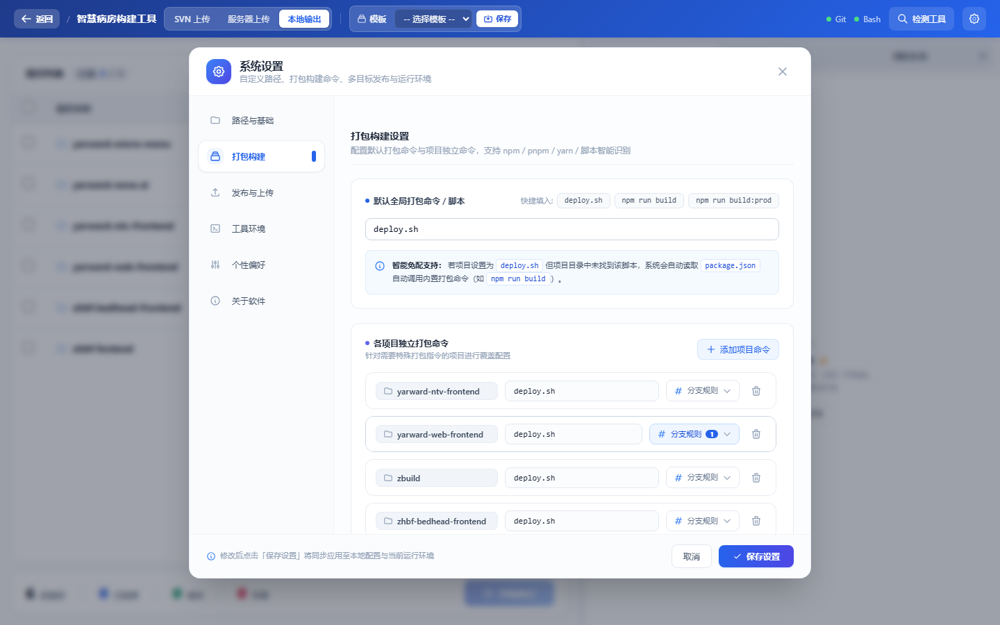
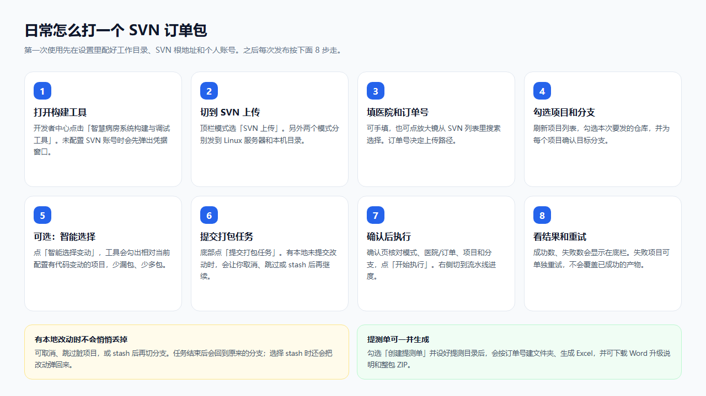
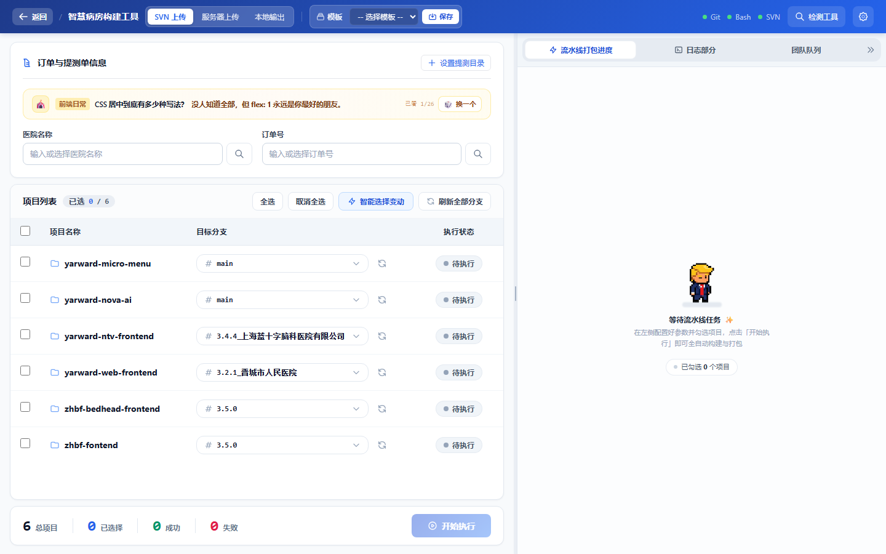
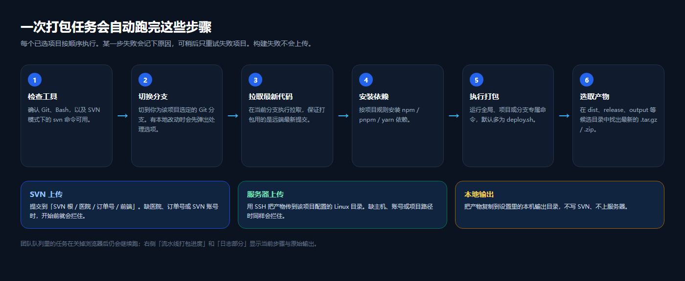
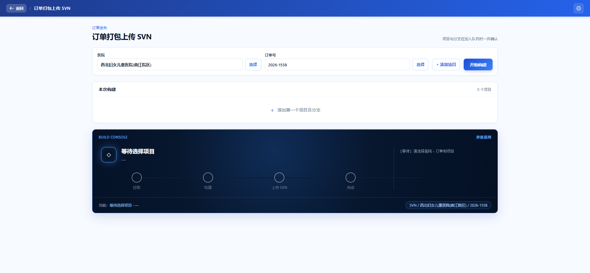

# 智慧病房系统构建与调试工具 使用说明

版本：1.0.6  
适用对象：需要打包前端工程、提交测试订单包的开发与实施同事  
运行方式：浏览器打开即可，不需要在本机安装 Electron 客户端

---

## 1. 能做什么

这是一套给智慧病房前端工程用的 **Web 打包发布工具**。打开开发者中心后，核心构建提供三套发布方式：

| 方式 | 适合场景 | 产物去向 |
|---|---|---|
| **SVN 上传** | 正式提测、按医院订单发版 | `SVN 根 / 医院 / 订单号 / 前端` |
| **服务器上传** | 测试机、预发环境 | 各项目配置的 Linux 目录（SSH） |
| **本地输出** | 只打包、不上仓库 | 本机指定目录 |

同一套流水线会按勾选项目 **顺序执行**：检查工具 → 切分支 → 拉代码 → 装依赖 → 打包 → 选产物 → 按当前模式发布。某一步失败会记下原因，构建失败不会上传。



开发者中心还内置另外两套工具，**不替代**上面的正式打包：

- **测试订单部署解决方案**：浏览 SVN 上的测试订单目录，按需勾选安装包，下载后上传到目标 Linux 并解压覆盖。
- **终端数据链路提取控制台**：联调、演示造数，不参与正式打包发布。

---

## 2. 怎么打开

工具以 Web 服务运行。同事用浏览器访问即可，构建在服务端执行。



### 开发机（本仓库）

在项目根目录执行：

```bat
npm run web
```

会启动服务并打开浏览器。也可以先 `npm run dev` 只跑前端。

### 交付包（给实施 / 公共机构建机）

1. 把 `zbuild-web-server-*` 整夹拷到目标机。
2. 双击 `Start-Web.bat`。
3. 包内已带 Python、Node、Git、SVN，目标机一般不用再装运行时。
4. 项目 Git 仓库必须能从这台机器访问到。

### 浏览器访问

- 本机一般是 `http://127.0.0.1:8000`
- 局域网同事用服务器 IP 加同一端口
- 防火墙需放行 **TCP 8000**

首次启动会在数据目录写入 `.zbuild-data/web-config.json`。  
**SVN 账号按浏览器分别保存**，不会显示回页面。工作目录、SVN 根地址、构建命令由服务端统一维护。

---

## 3. 开发者中心

打开后先进入开发者中心，三张核心卡片对应三套内置工具。日常打订单包点左侧第一张：**智慧病房系统构建与调试工具**。



未配置 SVN 账号时，进入构建、订单部署或订单打包上传都会先弹出凭据窗口。填用户名和密码，点 **保存并进入应用**。账号只保存在当前浏览器。



---

## 4. 第一次要配的系统设置

进入构建工具后，点右上角齿轮打开 **系统设置**。建议按下面六个页签过一遍。



| 页签 | 配什么 |
|---|---|
| **路径与基础** | 工作目录。工具会扫描该目录下的 Git 仓库。 |
| **打包构建** | 默认命令（多为 `deploy.sh`）、各项目独立命令、分支规则、产物候选目录。 |
| **发布与上传** | SVN 根 URL、统一上传子目录（默认「前端」）、常用 SVN 源、服务器路径、个人 SVN 账号。 |
| **工具环境** | Git / Bash / SVN / Node 路径。顶栏 **检测工具** 可自动找。 |
| **个性偏好** | 桌宠等界面偏好，不影响打包结果。 |
| **关于软件** | 版本信息。当前产品版本见 `package.json`。 |

工作目录配好后，项目列表才会出现仓库。顶栏 Git / Bash / SVN 指示灯变绿，说明本机工具可用。



打包命令说明：

- 全局默认一般是 `deploy.sh`。
- 某个项目找不到该脚本时，会自动读 `package.json`，回退到内置打包命令（如 `npm run build`）。
- 产物会在 `dist`、`release`、`output` 等候选目录里找最新的 `.tar.gz` / `.zip`。

---

## 5. 日常怎么打一个 SVN 订单包

第一次配好工作目录、SVN 根地址和个人账号后，每次发布按下面走。



主界面如下。顶栏切到 **SVN 上传**，左侧填订单、勾项目，右侧看进度和日志。



### 操作步骤

1. **打开构建工具**  
   开发者中心点击「智慧病房系统构建与调试工具」。未配置 SVN 时会先弹出凭据窗口。

2. **切到 SVN 上传**  
   顶栏模式选 **SVN 上传**。另外两个模式分别发到 Linux 服务器和本机目录。

3. **填医院和订单号**  
   可手填，也可点放大镜从 SVN 列表里搜索选择。订单号决定上传路径。

4. **勾选项目和分支**  
   刷新项目列表，勾选本次要发的仓库，并为每个项目确认目标分支。

5. **可选：智能选择变动**  
   点 **智能选择变动**，工具会勾出相对当前配置有代码变动的项目，少漏包、少多包。

6. **点开始执行**  
   底栏点 **开始执行**。若项目有未提交的本地改动，会先让你选择处理方式。

7. **确认后再跑**  
   确认页核对应模式、医院 / 订单、项目和分支，再点一次 **开始执行**。右侧切到 **流水线打包进度** 和 **日志部分**。

8. **看结果和重试**  
   成功数、失败数显示在底栏。失败项目可单独重试，不会覆盖已成功的产物。

### 有本地改动时

不会悄悄丢掉你的改动。可选：

- **取消执行**
- **跳过这些项目**
- **继续并 stash**（切分支前暂存；任务结束后会回到原来的分支，选择 stash 时还会把改动弹回来）

### 提测单

勾选 **创建提测单** 并设好提测目录后，会按订单号建文件夹、生成 Excel，并可下载 Word 升级说明和整包 ZIP。页面上也会给出下载入口，避免浏览器静默拦截。

顶栏 **模板** 可保存当前医院、订单、项目和分支组合，下次直接套用。

---

## 6. 一次任务会自动跑完这些步骤

每个已选项目按顺序执行。某一步失败会记下原因，可稍后只重试失败项目。**构建失败不会上传。**



| 步骤 | 做什么 |
|---|---|
| 1. 检查工具 | 确认 Git、Bash，以及 SVN 模式下的 `svn` 命令可用 |
| 2. 切换分支 | 切到你为该项目选定的 Git 分支 |
| 3. 拉取最新代码 | 在当前分支执行拉取，保证打包用的是远端最新提交 |
| 4. 安装依赖 | 按项目规则安装 npm / pnpm / yarn 依赖 |
| 5. 执行打包 | 运行全局、项目或分支专属命令，默认多为 `deploy.sh` |
| 6. 选取产物 | 在 `dist`、`release`、`output` 等候选目录中找出最新压缩包 |
| 7. 按模式发布 | 见下表 |

发布阶段按顶栏模式分流：

- **SVN 上传**：提交到「SVN 根 / 医院 / 订单号 / 前端」。缺医院、订单号或 SVN 账号时，开始前就会拦住。
- **服务器上传**：用 SSH 把产物传到该项目配置的 Linux 目录。缺主机、账号或项目路径时同样会拦住。
- **本地输出**：把产物复制到设置里的本机输出目录，不写 SVN、不上服务器。

团队队列里的任务在关掉浏览器后仍会继续跑。右侧 **流水线打包进度**、**日志部分**、**团队队列** 分别显示当前步骤、原始输出和排队中的任务。

---

## 7. 另外两套内置工具

### 测试订单部署

从 SVN 订单目录树勾选已有安装包，下载后上传到目标 Linux 并自动解压覆盖。适合现场和测试环境，不重新构建源码。

### 订单打包上传 SVN

适合「已经选好医院 / 订单，再按项目逐个加入构建队列」的简化流程。



---

## 8. 常见问题

**顶栏 Git / Bash / SVN 是红点**  
点 **检测工具**。交付包应能自动找到内置运行时；开发机需本机已安装对应命令，或在「工具环境」里手动指定路径。

**项目列表是空的**  
先在设置里配好 **工作目录**。目录下要有 Git 仓库。配完后刷新或重新进入构建工具。

**进应用一直要填 SVN**  
账号按浏览器保存。换了浏览器、清了站点数据，或用隐私窗口，都要再填一次。密码不会回传到页面。

**SVN 上传点了开始执行没反应 / 被拦住**  
检查医院名称、订单号、SVN 账号是否都填了，以及至少勾选了一个项目。

**构建成功但没传到 SVN**  
看日志里上传步骤。常见原因：SVN 根 URL 不对、没有「前端」目录写权限、账号密码错误、网络到 `10.1.1.120` 不通。

**有未提交改动怎么办**  
不要强行切分支。按弹窗选择跳过、stash 或取消。stash 路径会在任务结束后尝试恢复工作区。

**局域网同事打不开**  
确认服务是 `0.0.0.0:8000` 在听，Windows 防火墙放行 TCP 8000，并用服务器的局域网 IP 而不是 `127.0.0.1`。

**关掉页面任务是不是停了**  
不会。任务在服务端继续跑，其他人打开 **团队队列** 也能看到。

---

## 9. 相关文件

| 文件 | 用途 |
|---|---|
| `tools/start_web.bat` / 交付包里的 `Start-Web.bat` | 启动 Web 服务 |
| `tools/package_web_server.ps1` | 打出自包含 Web 交付目录 |
| `release/zbuild-web-server-ready/DEPLOYMENT.txt` | 交付包简要部署说明 |
| `.zbuild-data/web-config.json` | 服务端系统配置（首次启动生成） |
